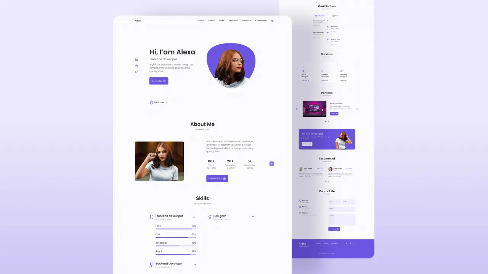

# Responsive Portfolio Website - Alexa

## [Watch it on youtube](https://youtu.be/FVgvht4B3mo)

Welcome to Alexa's responsive portfolio website project. This website is designed to showcase Alexa's portfolio and skills as a web developer. The website is fully responsive and compatible with all modern devices, including desktops, tablets, and mobile phones.

<hr>

💙 Join the channel to see more videos like this. [Code_With_Pankaj](https://www.youtube.com/c/CodeWithPankaj1?sub_confirmation=1)
<hr>

<div align=center>

## Must visit 👇 (Click on it)

[](https://www.youtube.com/c/CodeWithPankaj1?sub_confirmation=1)

</div>

<hr>

# Features

- Responsive design that adapts to all screen sizes.
- Day/night mode that changes the color scheme of the website.
- Customizable color palette that can be adjusted to suit your preferences.
- Interactive navigation menu that scrolls smoothly to the relevant sections of the website.
- Interactive project gallery that displays Alexa's recent projects.
- Contact form that allows visitors to send a message directly to Alexa.

# Technologies Used
HTML <br>
CSS <br>
JavaScript <br>
Bootstrap <br>
jQuery <br>
FontAwesome <br>
Google Fonts

## Authors

- [@pankajbaliyan](https://www.github.com/pankajbaliyan)


## Contributing

This project is open for contributions. If you would like to contribute to this project, you can fork the repository and submit a pull request.<br>
Contributions are always welcome!

See `index.html` for ways to get started.

Please adhere to this project's `code of conduct`.


## Demo

https://responsive-portfolio-website-alexa-cwp.vercel.app
<br><br>
https://pankajkumar90.github.io/Responsive_Portfolio_Website_Alexa/


## Feedback

If you have any feedback, please reach out to us at pankajbaliyan90@gmail.com


## 🔗 Links

[](https://www.linkedin.com/in/pankaj-kumar-90/)

<br>

[](https://codewithpankaj.vercel.app)

## Lessons Learned

Importance of responsive design: Building a website that is compatible with different devices is essential to ensure that it reaches a wider audience. By making your website responsive, you have ensured that your website is accessible to visitors using desktops, laptops, tablets, and mobile devices.

User interface design principles: Designing a user-friendly interface is critical for enhancing user experience. By implementing interactive navigation, a project gallery, and a contact form, you have created an engaging and interactive experience for visitors to your website.

Utilizing CSS frameworks: By leveraging the power of CSS frameworks such as Bootstrap, you were able to create a more efficient development process and produce a more consistent design. This can be especially useful when working on larger projects.

Understanding of CSS and JavaScript: To implement the customizations you wanted in your website, you needed a solid understanding of CSS and JavaScript. This is crucial for any web developer, and by creating this project, you likely honed your skills in these areas.

Attention to detail: When building a website, small details can make a big difference in enhancing the user experience. By implementing a day/night mode and a customizable color palette, you have demonstrated attention to detail and a commitment to providing a personalized experience for visitors to your website.

Version control: By using Git and GitHub to manage your code, you have learned about version control and the importance of tracking changes to your code. This can be particularly useful when collaborating with others or when working on larger projects.
## Run Locally

Clone the project

```bash
  git clone https://github.com/PankajBaliyan/Responsive_Portfolio_Website_Alexa.git
```

Go to the project directory

```bash
  cd Responsive_Portfolio_Website_Alexa
```

Start code editor

```bash
  code .
```


## Screenshots




## Support

For support, email pankajbaliyan90@gmail.com or join our Slack channel.